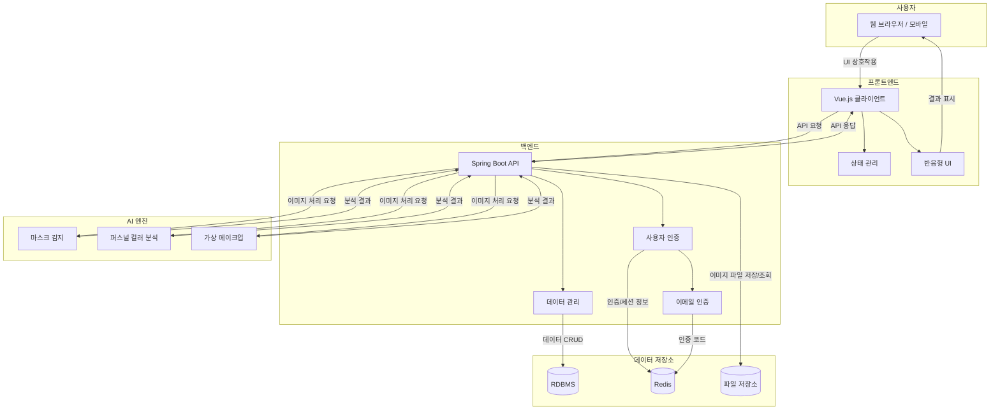

# **🎭 AI 이미지 분석 (마스크 & 퍼스널컬러)**

## 📌 프로젝트 목표 및 개요

자신의 외모와 스타일에 관심이 많은 사용자들을 위해, AI 기술을 활용하여 **마스크 착용 여부를 정확히 판별**하고 **개인에게 맞는 퍼스널 컬러를 진단**해주는 웹 서비스입니다. 나아가 **가상 메이크업 시뮬레이션** 기능을 통해 사용자가 다양한 스타일을 미리 경험해볼 수 있는 통합적인 이미지 분석 및 뷰티 솔루션 플랫폼을 구축하는 것을 목표로 했습니다.

---

## ✨ 주요 기능 및 가치

- **정확한 마스크 착용 여부 판별:** 사용자가 업로드한 사진에서 OpenCV와 VGGNet-16 딥러닝 모델을 통해 마스크 착용 상태를 자동으로 감지하고, 필요한 경우 안내 가이드까지 제공합니다. 다양한 환경에서도 높은 정확도를 위해 이미지 전처리 파이프라인을 적용했습니다.
- **나에게 맞는 색깔 찾기 (AI 퍼스널 컬러 진단):** 이미지 분석을 통해 사용자에게 가장 잘 어울리는 퍼스널 컬러 타입(봄/여름/가을/겨울)을 예측하고, 결과에 맞는 색상 팔레트와 스타일링 팁(메이크업, 의상)을 시각적으로 제공하여 활용도를 높였습니다.
- **미리 해보는 가상 메이크업 (BeautyGAN 활용):** 사용자의 얼굴 이미지에 다양한 메이크업 스타일을 자연스럽게 적용해보는 시뮬레이션 기능을 제공합니다. 원본 이미지의 특징은 유지하면서 새로운 스타일을 미리 경험하고, 결과를 저장하거나 공유할 수 있습니다.
- **안전한 회원 관리 및 개인화 경험:** Redis를 활용한 이메일 인증으로 회원가입 절차의 보안성을 높였으며, 마이페이지를 통해 사용자가 과거 진단 결과(퍼스널 컬러, 시뮬레이션)를 확인하고 관리할 수 있도록 개인화 기능을 제공합니다.

---

## 💡 주요 기술 선택 및 이유

- **마스크 감지 (VGGNet-16):** 높은 정확도(테스트 기준 98.39%)와 비교적 간단한 구조, 사전 학습된 가중치 활용 가능성을 고려하여 VGGNet-16 모델을 선택했습니다.
- **가상 메이크업 (BeautyGAN):** 원본 이미지 특성을 보존하면서 자연스러운 메이크업 효과를 생성하는 능력 때문에 BeautyGAN 모델을 채택했습니다. 다양한 손실 함수 조합 최적화 및 히스토그램 매칭 기법으로 성능을 높였습니다.
- **이메일 인증/세션 (Redis):** 빠른 응답 속도가 중요한 인증 코드 관리 및 세션 처리에 인메모리 데이터베이스인 Redis를 활용하여 시스템 효율성을 증대시켰습니다.
- **백엔드 (Spring Boot):** 안정적인 서비스 운영과 확장성, JPA/Mybatis 등 풍부한 생태계 지원, 의존성 주입(DI)의 편리성 등을 고려하여 Spring Boot를 백엔드 프레임워크로 선택했습니다.

---

## 🔧 기술적 도전과 해결 과정

- **어려움 극복: 다양한 환경에서의 마스크 인식 정확도 향상**
    - **문제:** 조명, 각도, 마스크 종류에 따라 인식률이 달라지는 문제 발생.
    - **해결:** OpenCV를 이용한 이미지 정규화, 명암비 조절 등 전처리 단계를 강화하고, 데이터 증강(Data Augmentation) 기법을 적용하여 다양한 환경에 대한 모델의 강인함(Robustness)을 높였습니다. VGGNet-16 모델과 조합하여 최종 98% 이상의 인식 정확도를 달성했습니다.
        
    

        
- **어려움 극복: 자연스러운 가상 메이크업 구현 (BeautyGAN 최적화)**
    - **문제:** 메이크업 스타일 적용 시 원본 얼굴 특징이 부자연스럽게 변형되는 현상 발생.
    - **해결:** 여러 손실 함수(적대적, 지각적, 사이클 일관성, 메이크업 손실)의 가중치를 조정하며 최적의 조합을 찾고, 히스토그램 매칭 기법으로 얼굴/눈/입술 등 부위별로 메이크업 스타일을 분리하여 적용하는 방식을 도입했습니다.
- **어려움 극복: 안정적인 이메일 인증 시스템 구축**
    - **문제:** 안전하면서도 사용자에게 번거롭지 않은 이메일 인증 절차 구현 필요.
    - **해결:** Spring Mail을 통해 인증 메일을 발송하고, 발급된 임시 인증 코드는 만료 시간을 설정하여 Redis에 저장/관리했습니다. 사용자가 코드를 입력하면 Redis에서 빠르게 검증하여 회원가입 프로세스의 보안성과 효율성을 동시에 확보했습니다.

---

## 🏗️ 시스템 아키텍처

---

## 🛠️ 기술 스택

- **Frontend:** Vue.js, Vuex, Vue Router, Axios, Tailwind CSS, HTML5, CSS3
- **Backend:** Spring Boot, Spring Security, JPA, Mybatis, Spring Mail, Java
- **AI & Image Processing:** TensorFlow, Keras, OpenCV, Python, BeautyGAN, MediaPipe
- **Database & Cache:** RDBMS (Oracle/MySQL 등), Redis
- **Infra & DevOps:** Docker, Jenkins (CI/CD), JUnit, Selenium
- **Collaboration:** Git, GitHub, Notion

---

## 👤 나의 역할 및 기여

- **사용자 중심 UI/UX 설계 및 구현:** 자가진단, Q&A 등 핵심 기능의 사용자 인터페이스를 직관적으로 설계하고 Vue.js로 구현했습니다.
- **데이터 확보 및 AI 모델 학습 지원:** 모델 학습에 필요한 이미지 데이터를 크롤링하고, 데이터 증강 기법을 적용하여 학습 데이터셋의 품질과 양을 개선했습니다.
- **디자인 시스템 및 검수:** 프로젝트 전반의 디자인 일관성을 유지하기 위해 가이드라인을 검토하고, 주요 페이지 디자인에 참여했습니다.
- **백엔드-프론트엔드 연동:** Spring Boot 백엔드와 Vue.js 프론트엔드 간의 원활한 데이터 통신을 위한 API 연동 및 테스트를 담당했습니다.
- **관리자 기능 개발:** 회원 관리 및 시스템 모니터링 등 운영에 필요한 관리자 페이지 기능을 구현했습니다.

---

## 🌱 성장 및 배움 (Key Takeaways)

- **AI 모델의 실제 웹 서비스 적용 및 배포 경험:** 딥러닝 모델을 학습시키는 것을 넘어, 실제 사용자가 이용하는 웹 서비스에 통합하고 배포하는 전체 과정을 경험했습니다.
- **풀스택 개발 역량 심화:** 프론트엔드(Vue.js)와 백엔드(Spring Boot)를 아우르는 개발 경험을 통해 양쪽 기술 스택에 대한 이해도를 높이고 풀스택 개발자로서의 역량을 강화했습니다.
- **대용량 이미지 데이터 처리:** 사용자가 업로드하는 이미지 데이터를 효과적으로 처리하고 AI 모델과 연동하는 과정에서 성능 최적화의 중요성을 배웠습니다.
- **팀 협업 및 문제 해결:** 팀원들과의 적극적인 소통과 Git/GitHub를 활용한 효율적인 버전 관리를 통해 협업 역량을 키우고 기술적 문제들을 함께 해결해 나갔습니다.

### 🚀 향후 개선 방향

- **모바일 최적화 및 앱 개발:** 더 많은 사용자가 편리하게 이용할 수 있도록 반응형 웹 디자인을 개선하고, 나아가 네이티브 모바일 앱 개발을 검토합니다.
- **기능 확장:** 퍼스널 컬러 진단의 세분화(예: 웜톤/쿨톤 상세 분류), 더 다양한 가상 메이크업 스타일 및 제품 연동 등을 추가합니다.
- **실시간 분석:** 웹캠을 이용한 실시간 마스크 착용 감지 또는 퍼스널 컬러 진단 기능을 구현합니다.
- **성능 개선:** AI 모델 경량화 및 서버 최적화를 통해 응답 속도를 개선하고 사용자 경험을 향상시킵니다.

---

