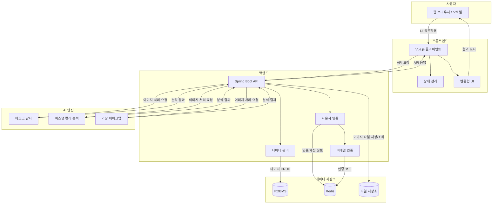

## **🎭 AI 이미지 분석 (마스크 & 퍼스널컬러)**

### 📌 프로젝트 목표 및 개요

> 사용자에게 외모 스타일링에 대한 인사이트와 가이드를 제공하기 위해
> 
> 
> **마스크 착용 여부 감지, 퍼스널 컬러 진단, 가상 메이크업 시뮬레이션**을 통합한
> 
> **AI 기반 뷰티 솔루션 웹 서비스**를 설계·구현했습니다.
> 

---

### 🎯 주요 기능

- **마스크 감지 기능 (VGGNet-16 기반)**
    - 이미지 업로드 시 **마스크 착용 여부 자동 인식**
    - 다양한 환경에서도 높은 정확도 확보 (정확도 98%)
- **AI 퍼스널 컬러 진단**
    - 이미지 분석 기반 **봄/여름/가을/겨울 타입 분류**
    - 진단 결과에 따라 컬러 팔레트 및 스타일링 팁 제공
- **가상 메이크업 시뮬레이션 (BeautyGAN 활용)**
    - 다양한 메이크업 스타일을 얼굴에 자연스럽게 시뮬레이션
    - 결과 저장 및 공유 기능 제공
- **사용자 관리 및 이력 저장 기능**
    - **Redis 기반 이메일 인증**으로 보안성 강화
    - **마이페이지에서 과거 진단 결과 확인** 및 개인화 기능 제공

---

### 🧩 기술 스택

- **Frontend**: Vue.js · Vuex · Vue Router · Tailwind CSS · Axios
- **Backend**: Spring Boot · JPA · MyBatis
- **AI & Image Processing**: TensorFlow · OpenCV · MediaPipe · BeautyGAN
- **Database / Cache**: MySQL · Oracle · Redis
- **Infra / DevOps**: Docker · Jenkins · JUnit · Selenium
- **Collaboration**: Git · GitHub · Notion

### ⚙️ 기술 선택 요약

> 마스크 감지를 위한 VGG16, 자연스러운 스타일링을 위한 BeautyGAN을 사용하고,
> 
> 
> 빠르고 안전한 인증 처리를 위해 **Redis 기반 인증 시스템**을 구성하였습니다.
> 
> Docker 기반 환경 통일로 배포 효율성과 개발 속도를 높였습니다.
> 

---

### 👨‍💻 주요 역할 및 기여

- **사용자 중심 UI/UX 설계 및 Vue.js 기반 구현**
- **Spring Boot 백엔드와 프론트 간 API 연동 설계 및 개발**
- **AI 모델 학습 지원용 이미지 데이터 수집 및 증강 처리**
- **퍼스널 컬러 진단 UI 및 결과 페이지 시각화 구현**
- **관리자 기능 개발: 회원 관리 및 시스템 모니터링 기능 추가**

---

### 🏆 주요 성과

- **VGG16 기반 마스크 감지 모델 훈련, 정확도 98% 달성**
- **퍼스널 컬러 진단 알고리즘 설계 및 사용자 피드백 시스템 구축**
- **AI 모델을 웹 서비스에 통합하여 이미지 기반 진단 기능 실현**
- **Redis 인증 시스템 도입으로 인증 응답 처리 속도 개선**

---

### 💡 기술적 도전 및 해결

- **다양한 환경에서 마스크 감지 정확도 유지**
    
    → OpenCV 기반 이미지 전처리 + 데이터 증강으로 성능 향상
    
- **자연스러운 가상 메이크업 구현**
    
    → BeautyGAN 손실 함수 조정 및 부위별 매칭 최적화 적용
    
- **이메일 인증 시스템의 보안성과 속도 확보**
    
    → Spring Mail + Redis 조합으로 사용자 인증 처리 개선
    

---

### 🏗️ 시스템 아키텍처

---

### 🌱 성장 및 배움

- **AI 모델의 실서비스 적용과 운영 경험 확보**
- **Vue.js–Spring Boot 간 풀스택 통신 구조에 대한 실전 경험 축적**
- **이미지 처리 기반 성능 최적화 및 사용자 인터랙션 개선 역량 강화**
- **Git/GitHub 기반 협업 및 문제 해결 능력 향상**

---

### 🚀 향후 개선 방향

- 실시간 웹캠 기반 분석 기능 확장 (마스크 감지, 퍼스널 컬러 진단)
- 가상 메이크업에 다양한 스타일/브랜드 연동 기능 추가
- 반응형 웹 고도화 및 모바일 앱 개발 연계
- AI 모델 경량화 및 서버 최적화를 통한 응답 속도 개선

---
